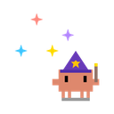
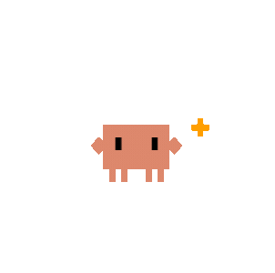
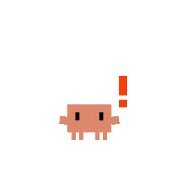
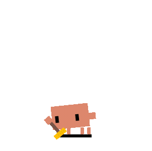
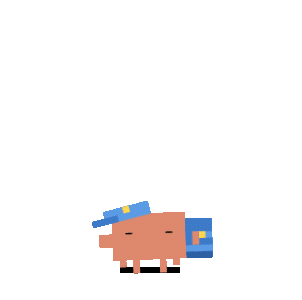
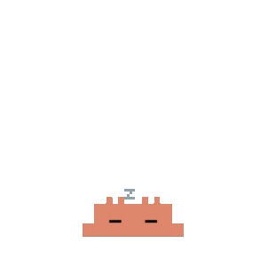
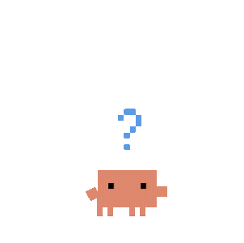
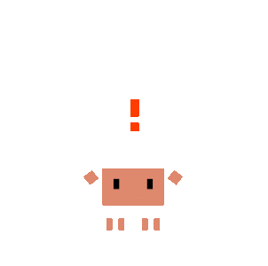

<p align="center">
  
</p>
<h1 align="center">Clawd on VS Code</h1>
<p align="center">
  A tiny sidebar spell for watching your coding agents work.
</p>

Clawd on VS Code is a workspace extension that brings the Clawd on Desk agent-status experience into the VS Code sidebar. It runs the Clawd state server inside the VS Code extension host, which lets local workspaces and Remote-SSH sessions report coding-agent activity without a separate desktop tunnel.

The extension renders an animated Clawd or Calico pet in the Activity Bar view, tracks supported agent sessions, shows permission and notification prompts in the sidebar, and can sync the same agent hook/plugin integrations used by Clawd on Desk.

## Features

- Sidebar Clawd view with live state, session, and server status.
- Built-in Clawd and Calico themes vendored from Clawd on Desk.
- Workspace-hosted runtime for local and Remote-SSH extension hosts.
- Codex CLI and Gemini CLI log monitoring.
- Hook/plugin sync for Claude Code, Gemini CLI, Cursor Agent, CodeBuddy, Kiro CLI, and opencode.
- Permission handling for supported agents, including opencode once/always replies and Claude Code-style permission responses.
- Do Not Disturb, theme switching, runtime pause/resume/restart, integration enable/disable, and terminal focus actions from the view or command palette.

## Animations and Interaction

Clawd on VS Code uses the same theme assets as Clawd on Desk, but renders them inside the VS Code Activity Bar webview instead of as a desktop overlay. The pet reacts to agent state changes in real time and keeps the interaction model focused on the sidebar.

### Animation States

<table>
  <tr>
    <td align="center"><br><sub>Idle + eye tracking</sub></td>
    <td align="center"><br><sub>Thinking</sub></td>
    <td align="center"><br><sub>Working / typing</sub></td>
    <td align="center"><br><sub>Building</sub></td>
    <td align="center"><br><sub>Juggling</sub></td>
    <td align="center"><br><sub>Conducting</sub></td>
  </tr>
  <tr>
    <td align="center"><br><sub>Error</sub></td>
    <td align="center"><br><sub>Attention / done</sub></td>
    <td align="center"><br><sub>Notification</sub></td>
    <td align="center"><br><sub>Sweeping / compact</sub></td>
    <td align="center"><br><sub>Carrying</sub></td>
    <td align="center"><br><sub>Sleeping / DND</sub></td>
  </tr>
</table>

The Calico theme uses animated APNG assets for the same state machine:

<table>
  <tr>
    <td align="center"><br><sub>Idle</sub></td>
    <td align="center"><br><sub>Thinking</sub></td>
    <td align="center"><br><sub>Typing</sub></td>
    <td align="center"><br><sub>Building</sub></td>
    <td align="center"><br><sub>Juggling</sub></td>
    <td align="center"><br><sub>Conducting</sub></td>
  </tr>
  <tr>
    <td align="center"><br><sub>Error</sub></td>
    <td align="center"><br><sub>Attention / done</sub></td>
    <td align="center"><br><sub>Notification</sub></td>
    <td align="center"><br><sub>Sweeping</sub></td>
    <td align="center"><br><sub>Carrying</sub></td>
    <td align="center"><br><sub>Sleeping</sub></td>
  </tr>
</table>

### Sidebar Interactions

<table>
  <tr>
    <td align="center"><br><sub>Eye tracking</sub></td>
    <td align="center"><br><sub>Drag reaction</sub></td>
    <td align="center"><br><sub>Idle click reaction</sub></td>
    <td align="center"><br><sub>Calico peek</sub></td>
  </tr>
</table>

<p align="center">
  
  <br><sub>Permission review layout adapted from Clawd on Desk; the VS Code extension renders this workflow as sidebar cards.</sub>
</p>

- **Eye tracking**: Clawd and Calico track pointer movement while the idle SVG is visible in the sidebar.
- **Drag from the sidebar**: press and drag the pet inside the view; a drag reaction plays, then the current state resumes when released.
- **Idle click reactions**: click the left or right side of the pet while idle to play the theme's reaction asset.
- **Terminal focus shortcut**: clicking the pet while it is actively working, thinking, notifying, or in an error state focuses the best matching VS Code terminal.
- **Permission cards**: Claude Code, CodeBuddy, opencode, and Codex notification flows render review cards inside the sidebar with agent badges, command/file previews, and allow/deny actions where supported.
- **Runtime controls**: the toolbar can install/sync integrations, disable/enable integrations, pause/resume the runtime, toggle Do Not Disturb, switch character, and restart the runtime.

### VS Code Extension vs. Clawd on Desk

| Capability | Clawd on VS Code | Clawd on Desk |
| --- | --- | --- |
| Agent-driven state animations | Yes, in the Activity Bar webview | Yes, as a desktop pet |
| Eye tracking | Yes, inside the sidebar stage | Yes, across the desktop pet window |
| Drag interaction | Yes, within the sidebar stage | Yes, across the desktop |
| Permission UI | Sidebar cards | Floating desktop bubbles |
| Runtime pause / integration disable | Yes | Not the same VS Code-scoped controls |
| Mini mode, system tray, click-through desktop overlay, global hotkeys | Not in this extension | Desktop app features |

## Installation

Install the packaged VSIX from this folder:

```bash
code --install-extension clawd-on-vscode-0.1.2.vsix
```

Or package a fresh VSIX locally:

```bash
npm install
npm run package
```

Open the **Clawd** view from the VS Code Activity Bar after installation. Use **Clawd: Install Agent Integrations** to sync supported agent hooks/plugins on the machine where the extension host is running.

Use **Clawd: Pause Runtime** to stop the local state server and log monitors without removing installed hooks. Use **Clawd: Disable Agent Integrations** when you want Clawd hooks/plugins removed so agent tool events no longer invoke Clawd at all.

## Development

```bash
npm install
npm run check
npm test
```

Open this folder in VS Code and press `F5` to launch an Extension Development Host. The extension activates on startup, when the Clawd view opens, or when one of its commands is invoked.

## Acknowledgments

This extension is based on and vendors runtime, hook, agent, theme, sound, and artwork assets from [Clawd on Desk](https://github.com/rullerzhou-afk/clawd-on-desk) by [@rullerzhou-afk](https://github.com/rullerzhou-afk).

Clawd on Desk credits the Clawd pixel art reference to [clawd-tank](https://github.com/marciogranzotto/clawd-tank) by [@marciogranzotto](https://github.com/marciogranzotto), and was shared with the [LINUX DO](https://linux.do/) community.

The Clawd character is an unofficial fan project inspired by Anthropic's Claude branding. This extension is not affiliated with or endorsed by Anthropic.

## License

Source code is licensed under the MIT License. See `LICENSE`.

Vendored artwork and media assets are not covered by the MIT license. They remain reserved by their respective copyright holders; see `ASSETS-LICENSE` for details.
