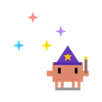
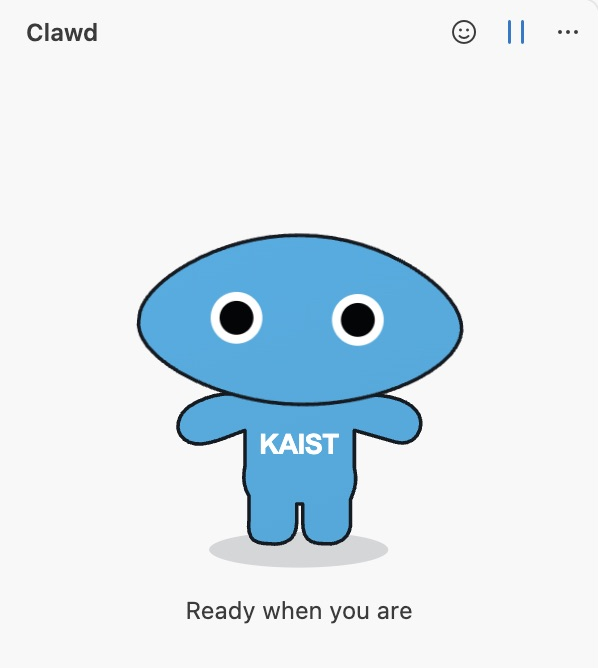
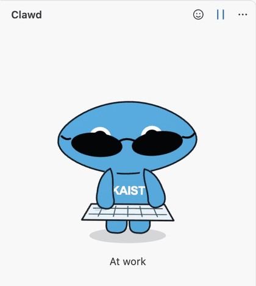
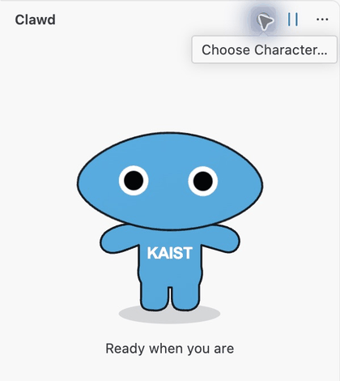
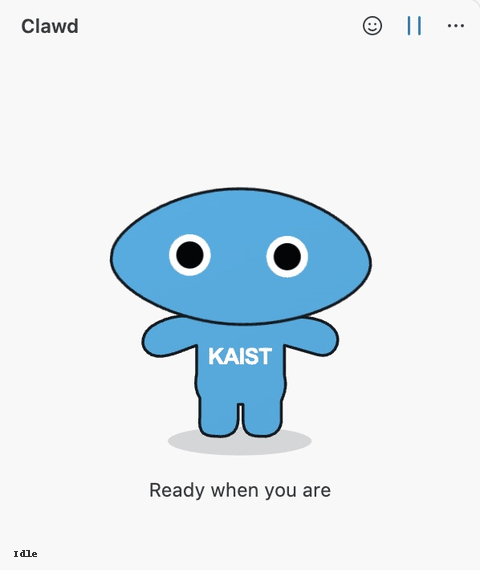
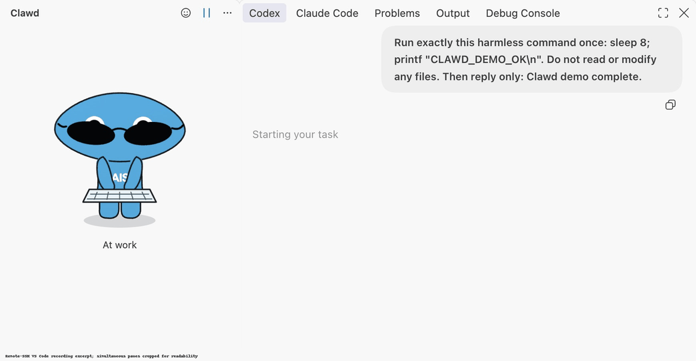

<p align="center">
  
</p>
<h1 align="center">Clawd on VS Code · 넙죽이</h1>
<p align="center">
  A little company while your coding agents work.
</p>

Clawd, Calico, and **Neobjuk (넙죽이)** live in the VS Code sidebar and react to your coding agents. Watch them type, think, celebrate, and rest; follow active sessions and handle supported permission requests beside your terminal.

<p align="center">
  
</p>

The runtime runs in the VS Code extension host, so local workspaces and Remote-SSH hosts can report activity on the same machine. Choose a character and pause/resume from the view titlebar. The **…** menu holds previews, notification preferences, agent connections, and diagnostics.

## Meet 넙죽이 · Neobjuk

Neobjuk brings the KAIST mascot reference to life with a broad, shallow head, raised shoulders, and short feet. Working brings alternating keyboard taps with short pauses to glance up; parallel subagents add a quicker rhythm and small task cards. Context organizing gathers scattered papers into a stack. Thinking, resting, and quiet moods keep gentle movement. Notifications sparkle with a rainbow, errors turn furious, and quiet time leads through sleepy poses before waking with the next activity.

While idle, its eyes follow your pointer. After a random 14–28 seconds in the neutral pose, it briefly looks around, stretches, sits with a heart, blushes, or sends a kiss. Clawd also occasionally glances around or scratches, and Calico plays its relaxed idle loop. These leisure reactions keep the “Ready when you are” label, avoid consecutive repeats when alternatives exist, and stop as soon as work or an approval arrives. Paused, hidden, or reduced-motion views do not start idle reactions.

<p align="center">
  
  
</p>

Recorded from the installed extension in a Remote-SSH VS Code window. The work clip uses test lifecycle events to exercise typing, parallel work, and context organizing; the idle clip captures an automatic reaction, with the initial quiet wait shortened in the recording.

<p align="center">
  
</p>

| Interaction while idle | Reaction |
| --- | --- |
| Click the left half | Shy blush |
| Click the right half | Kiss |
| Double-click, then click again | Rainbow, then a tilted heart |
| Four or more rapid clicks | Annoyed |
| Drag inside the sidebar | Excited; the live state resumes on release |

Clicking a busy pet focuses its matching VS Code terminal. Click a session row to focus that session's terminal. **Clawd: Preview Animation…** includes all 17 reference poses alongside the live animations; each preview lasts six seconds and then restores the current session display.

Clawd and Calico remain available through **Clawd: Choose Character…**. All three characters share the same agent connections, session list, and permission cards.

## Installation

Install [Clawd on VS Code from the VS Code Marketplace](https://marketplace.visualstudio.com/items?itemName=alex6095.clawd-on-vscode), or use the CLI:

```bash
code --install-extension alex6095.clawd-on-vscode
```

For a downloaded release VSIX:

```bash
code --install-extension clawd-on-vscode-0.2.2.vsix
```

Or package a fresh VSIX locally:

```bash
npm ci
npm run package
```

Open the **Clawd** view from the VS Code Activity Bar after installation. Use **Clawd: Set Up Agent Connections…** to sync supported agent hooks/plugins on the machine where the extension host is running.

Use **Clawd: Pause Clawd** to pause activity tracking and return approval requests to the agent. **Resume Clawd** restores tracking, including connections disabled in an earlier version. Removing connections is a separate action in the **…** menu; it preserves unrelated hooks.

## Agent connections

Opening Clawd does not rewrite agent configuration. **Set Up Agent Connections…** lets you select providers; Claude Code and Codex are the defaults. Hook installation applies to the machine hosting the extension, including Remote-SSH hosts.

<p align="center">
  
</p>

The clip above shows a real Remote-SSH Codex run using Luna Light: a harmless shell command completes with `CLAWD_DEMO_OK`. The simultaneous Clawd and Codex panes are cropped for readability. Clawd celebrates the completed Codex run, then returns to **At work** because another Claude session is still active.

Native hooks support Claude Code and Codex. Optional connections cover Gemini CLI, Cursor Agent, CodeBuddy, Kiro CLI, and opencode. Codex and Gemini CLI also support log monitoring.

- **Codex:** native command hooks report lifecycle, tools, approvals, compaction, interrupts, and subagents. Choose **Agent Connection Status…** for the current connection and a guide to Codex **Review hooks** (CLI: `/hooks`). Logs provide basic activity tracking until native hooks arrive. Private log formats can change, and log silence never produces an approval prompt.
- **Claude Code:** command hooks discover the matching VS Code runtime by working directory. Recent optional events are gated by the detected CLI version. WorktreeCreate is deliberately not registered because it replaces worktree creation.
- **Approvals:** a visible Clawd sidebar can answer an actual PermissionRequest. Hiding the view, DND, pause, disconnect, or “continue in terminal” returns control to the native agent. Claude AskUserQuestion preserves the original question structure; MCP elicitation remains with the native client.
- **Multiple windows:** separate runtime records route events to the most specific matching workspace. Empty windows receive otherwise unmatched local sessions. Session rows focus their own matching terminal.
- **Subagents:** parallel child IDs are tracked separately so one child finishing cannot end another child's work.

**Open Diagnostics** shows the selected agents, runtime port, session source, and Codex hook status.

| Setting | Default | Purpose |
| --- | --- | --- |
| `clawd.theme` | `clawd` | `clawd`, `calico`, or `neobjuk` |
| `clawd.integrations.agents` | Claude Code, Codex | Providers to observe and install |
| `clawd.codex.logFallback` | `true` | Read-only Codex transcript fallback |
| `clawd.sessions.scope` | `workspace` | Log visibility: workspace or all; native hooks retain window ownership |
| `clawd.animation.reducedMotion` | `system` | Follow OS preference, force on, or force off |

For remote use, install Clawd in the remote extension host and run the installer there. Terminal focusing is limited to terminals in that VS Code window. Clawd requires a trusted, filesystem-backed workspace.

### What “Review hooks” approves

Codex asks permission to run the installed Clawd event scripts on the same computer or SSH host. These scripts send session activity and working-folder details to Clawd over that host's loopback connection. The `PermissionRequest` script also sends the requested tool and its inputs for review, and returns your Allow/Deny choice for that one request. Trusting the hooks does not approve every future agent command.

In Codex **Review hooks**, expand **Details** and select only entries whose command points to this extension's `vendor/clawd/hooks/codex-hook.js`. Each entry has a `Clawd:` status label describing its event. Choose **Allow selected**. If the list still shows old commands or unnamed entries after setup, reload this VS Code window (or restart the CLI) to refresh it first. Other entries may belong to other tools. Codex stores trust for exact definitions, so an extension update that changes a command can require another review. Clawd itself never edits Codex's trust records. See the [official hook review guide](https://learn.chatgpt.com/docs/hooks#review-and-trust-hooks).

**Agent Connection Status…** distinguishes basic log tracking, installed hooks awaiting activity/review, and native events actually received in this window.

## Development

```bash
npm ci
npm run check
npm test
npm run package
npm run test:vscode
```

Open this folder in VS Code and press `F5` to launch an isolated Extension Development Host. Its profile, extensions, Claude config, and Codex home live in ignored `.debug/` folders. `test:vscode` installs the VSIX into a disposable profile and checks real HTTP events, native approval fallback, themes, and lifecycle commands in the installed VS Code application. Set `VSCODE_EXECUTABLE` if the CLI is not in the default location.

The extension activates on startup, when the Clawd view opens, or when one of its commands is invoked.

## Acknowledgments

This extension is based on and vendors runtime, hook, agent, theme, sound, and artwork assets from [Clawd on Desk](https://github.com/rullerzhou-afk/clawd-on-desk) by [@rullerzhou-afk](https://github.com/rullerzhou-afk).

Clawd on Desk credits the Clawd pixel art reference to [clawd-tank](https://github.com/marciogranzotto/clawd-tank) by [@marciogranzotto](https://github.com/marciogranzotto), and was shared with the [LINUX DO](https://linux.do/) community.

The Clawd character is an unofficial fan project inspired by Anthropic's Claude branding. This extension is not affiliated with or endorsed by Anthropic.

Neobjuk (넙죽이) is the KAIST mascot. Its character identity and reference artwork belong to their respective rights holders; the SVG reconstruction and animation are authored for this extension. This extension does not claim KAIST endorsement.

## License

Source code is licensed under the MIT License. See [LICENSE](LICENSE).

Artwork and media assets are not covered by the MIT license. They remain reserved by their respective copyright holders; see [ASSETS-LICENSE](ASSETS-LICENSE) for details.
